# RES-2021-Lab3-SMTP

> Auteurs : Robin Gaudin & Noémie Plancherel

## Description du projet

Dans le cadre d'un laboratoire durant le module de Réseaux (RES) à l'HEIG-VD, nous avons dû développer un client SMTP en Java par groupe de 2. Cette application utilise la Socket API pour communiquer avec un serveur SMTP MockMock.

Il met en place une application qui a pour but d'envoyer des mails prankés à plusieurs groupes avec des messages pré-définis. 

## Mise en place du serveur MockMock

Pour pouvoir tester notre application, nous avons utilisé un serveur "mock". C'est une interface de mail qui nous permet d'envoyer des "faux" emails et de pouvoir les visualiser. "Faux" dans le sens où les mails ne sont pas réellement envoyés. Cela nous permet d'éviter d'envoyer des mails par accident lors du test de l'application.

Afin de faciliter l'utilisateur, nous avons donc configuré un conteneur Docker pour le server mock SMTP. Pour ce faire, nous avons donc utilisé le serveur MockMock (https://github.com/tweakers/MockMock) qui est facile d'accès et a une interface web simple. 

Dans le projet, il y a dossier `SMTPServer`, qui se compose de:

- `Dockerfile`
- `MockMock-1.4.0.one-jar.jar`
- `build-image.sh`
- `run-container.sh`

Dans le fichier `Dockerfile`, on peut modifier le port pour la communication SMTP; nous avons configuré le serveur SMTP avec le port `7777`. Le second port précisé `8282` est le port par défaut pour la connexion web; si on voudrait le modifier, il faut modifier la dernière ligne du fichier par:

````bash
CMD ["java", "-jar", "/opt/app/mockmock.jar", "-p", "7777", "-h", "8080"]
````

/!\ Si le port web par défaut a été modifié, il faut également modifier la ligne du script `run-container.sh` par:

````bash
docker run -p 7777:7777 -p 8080:8080 mockserver
````

### Exécution

Pour exécuter le serveur SMTP en arrière plan, on lance premièrement le script `build-image.sh` pour créer le conteneur:

````bash
./build-image.sh
````

Puis on peut exécuter le second script, qui exécutera le conteneur:

````bash
./run-container.sh
````

Ces deux logs d'information devraient s'afficher:

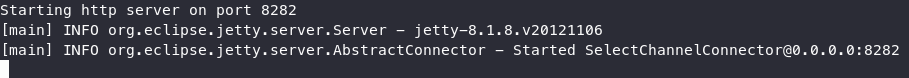

Il est à présent possible de se connecter à l'interface web à l'adresse: `http://localhost:8282`

## Utilisation du programme

### Liste des fichiers pour la configuration

Les fichiers contenant la configuration pour le client SMTP se trouvent dans le répertoire config à la base du projet :

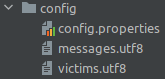

### Configurer les messages à envoyer

Les messages sont préparés dans le fichier `messages.utf8` et sont constitués d'une première ligne qui contiendra la sujet du mail. A noter qu'il n'est pas obligatoire de mettre `Subject:` devant, le sujet sera la ligne entière. Les lignes suivantes constitueront le contenu du mail. Pour terminer et séparer les messages, il suffit de mettre une ligne égale à `==`. 

Le fichier se présente donc sous la forme suivante:

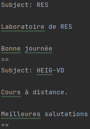

### Configurer la liste des destinataires

Le fichier `victims.utf8` contient toutes les adresses mails des gens faisant partie du prank. Elles sont séparées par un simple retour à la ligne. Voici un exemple :

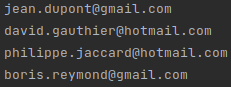

### Configurer les options du client SMTP

Le dernier fichier de configuration concerne les configurations du client SMTP. Pour changer l'adresse IP du serveur, il faut remplacer la valeur du champ `smtpServerAddress`. Il est par défaut à `localhost` pour un client en local. Le port utilisé par le serveur SMTP est à configurer dans le champ `smtpServerPort`. La valeur `numberOfGroups` est le nombre de mails à générer. Il faudra que le nombre d'adresses mails du fichier `victims.utf8` / le nombre de groupe soit plus grand ou égal à 3. Enfin, le champ `witnessesToCC` sont les adresses qui seront mises en copie du mail, elles doivent être séparées par une virgule.

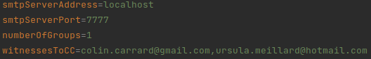

### Lancer l'application

Une fois toutes les modifications souhaitées effectuées, nous pouvons lancer notre application de prank. Pour ce faire, il faut premièrement build le projet en effectuant cette commande dans le répertoire racine du projet:

````bash
mvn clean install
````

Puis, on peut exécuter ces deux commandes afin de lancer notre application de prank:

````bash
cd target/
java -jar RES-2021-Lab3-SMTP-1.0-SNAPSHOT-standalone.jar
````

Une fois cette commande terminée, nous pouvons aller sur le naviguateur à l'adresse précisée plus haut, et on peut consulter le ou les mails.

### Test de fonctionnement

Pour savoir si notre application a réellement fonctionné, on devrait pouvoir visualiser nos mails dans le naviguateur:

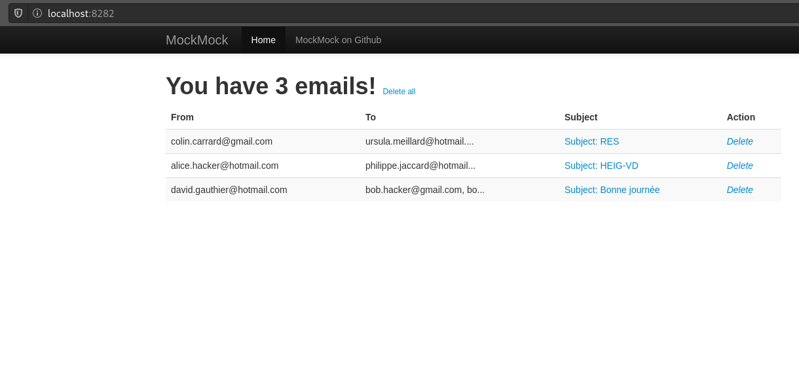

Si on ouvre un mail, on peut voir les détails:

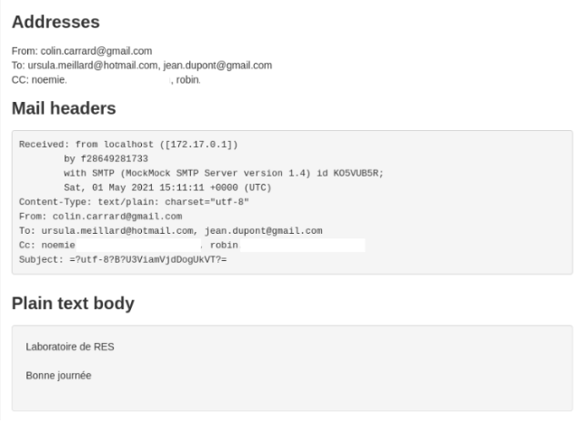

On peut également voir sur la console du serveur SMTP les mails envoyés:

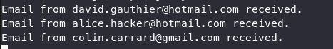

## Implémentation

### Structure du projet

Tous les fichiers .java se trouvent dans le répertoire src, qui se situe à la base du projet :

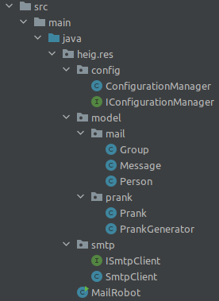

Les fichiers sources ont été séparés en différents package pour une meilleure organisation des fichiers.

### Diagramme de classe

Nous avons effectué un digramme de classe afin d'avoir une meilleure vision de notre implémentation. 

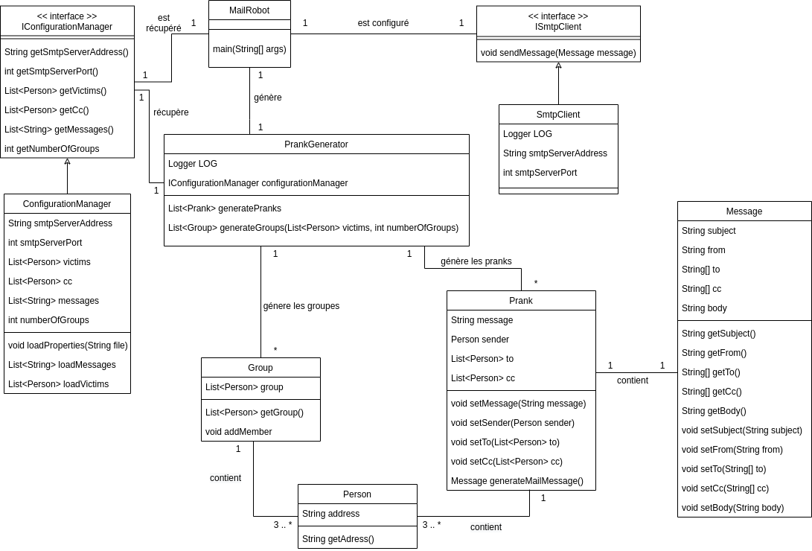

La classe `MailRobot` est la classe principale de l'application; elle s'occupe de récupérer les informations du client (le port et l'adresse IP). Ainsi, elle peut directement appeler le client SMTP qui s'occupe de tout le protocole. 

La classe `PrankGenerator` est la classe qui s'occupe de créer tous les pranks avec les groupes.

### Logs de l'application

Lors de chaque étape importante du protocole SMTP, nous avons ajouté un log qui affiche  l'action effectuée. Ainsi, nous pouvons facilement se rendre compte à quelle étape nous sommes.

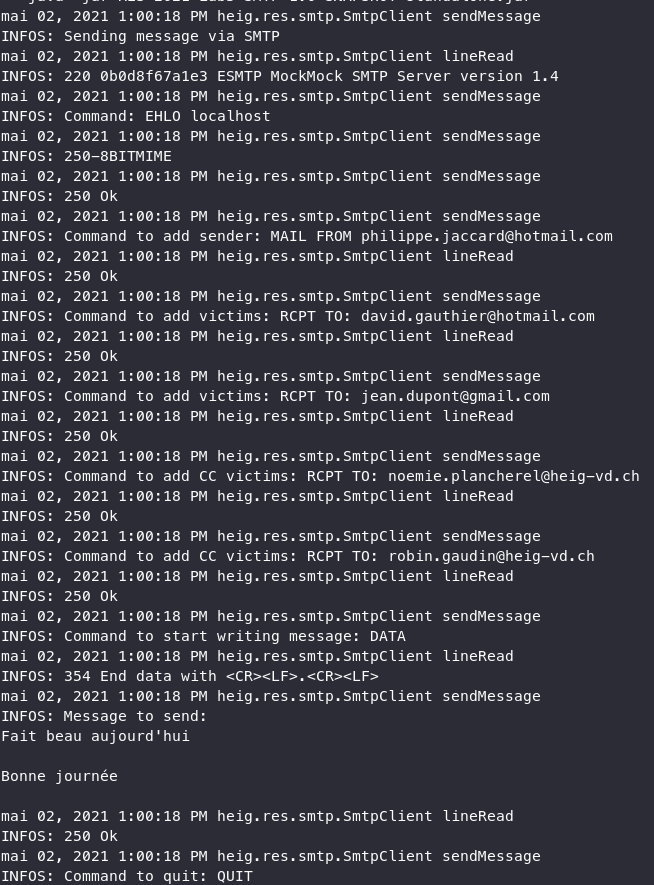